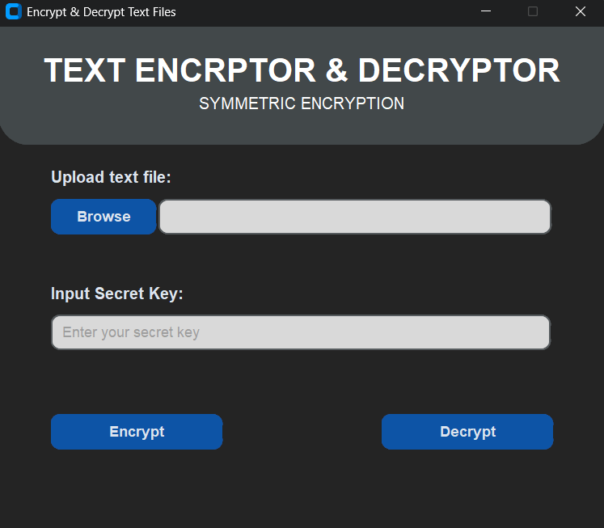
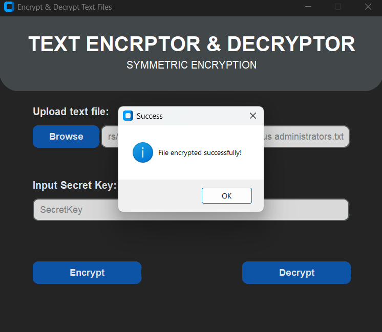

# File-Encryptor-Decryptor---mini_app
I created a simple symmetric encryptor/decryptor for text files using Python's CustomTkinter and Fernet cryptography.
=======
# Text Encrpytor & Decryptor 

I created a simple mini-app in Python that encrypts and decrypts text files using symmetric encryption. I used CustomTkinter to build the GUI and Fernet (from the cryptography library) for the encryption and decryption logic.

This was a small but fun project I took on to learn more about Python, GUI development, and the basics of cryptography. It helped me understand how secure data handling works, how to manage encryption keys safely, and how to create user-friendly interfaces using CustomTkinter.

# Fernet (Symmetric Encryption)
While browsing the internet one day, an idea struck me. I wanted to understand what cryptography really is and how I could implement it myself. That led me down, where I eventually stumbled upon Fernet's symmetric encryption.

Fernet caught my attention because it guarantees that a message encrypted with it can’t be read or tampered with without the proper key. It’s a form of symmetric (or “secret key”) authenticated cryptography, which means the same key is used for both encryption and decryption, while also ensuring data integrity.

There might be better and more secure ways to encrypt and decrypt data, but I think this is a great starting point for someone like me who’s new to the field.

# Here are a few things I learned while coding this project:
- How symmetric encryption works and why Fernet is a good choice for simple file encryption.
- How to integrate GUI components with backend logic in Python.
- The importance of error handling when working with file I/O and cryptographic operations.

# Possible future improvements:
- Add password-based key derivation (e.g., using PBKDF2) so users don’t have to manage raw keys.
- Support drag-and-drop for easier file selection.
- Add support for encrypting entire folders or binary files.

I'm eager to learn new things related to Python and cryptography. If you have any recommendations, feel free to comment or reach out. Thank you!

